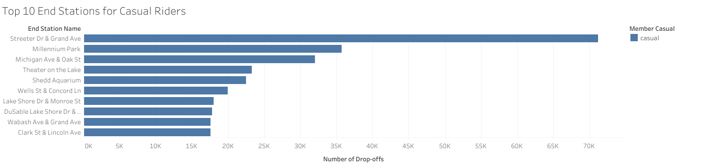

## Introduction

This project is the capstone assignment for the Google Data Analytics
Professional Certificate program. The program prepares participants for
a career in data analytics with training focused on key analytical
skills (data cleaning, analysis, and visualization) and tools (Excel,
SQL, R Programming, Tableau).

This project will analyze publicly available data sets, provided by the
course, for a bike share program based in Chicago.

### Table of Contents

-   [Summary](#Summary)
    - [Tools and Techniques](#Tools-and-Techniques)
    - [Recommendations](#Recommendations)
-   [Guiding Question](#Guiding-Question)
-   [Prepare Data](#Prepare-Data)
-   [Process Data](#Process-Data)
-   [Analysis](#Analysis)
-   [References](#References)
-   [Contact](#Contact)

## Summary

Cyclistic is a successful bike-share program launched in 2016. It has since grown to a fleet of 5,824 bicycles that are geo-tracked and locked into a network of 692 stations across Chicago. The bikes can be unlocked from one station and returned to any other station in the system anytime.

Cyclistic offers a variety of pricing plans including: single-ride passes, full-day passes, and annual memberships. Customers who purchase a single-ride or full-day passes are referred to as casual riders. Customers who purchase annual memberships are Cyclistic members.

### Guiding Question 

For this case study, our guiding question is: 

**How do annual members and casual riders use Cyclistic bikes differently?**

### Tools and Techniques 

Theis analysis made use of the following tools and techniques: 

- R programming language and libraries; `ggplot2`, `tibble`, `tidyr`, `readr`, `purrr`, `dplyr`, `stringr`, `lubridate` and `forcats`
- Data transformations: joins, visualizations, summary statistics
- Data inspection: removal of duplicate/unnessary data, change format/datatype, verify unique values

### Recommendations

The analysis yielded some key differences between member and casual riders of the Cyclistic bike share service. Most notably were the peak times and durations when casual riders use the service versus when member riders use the service. This led to the following recommendations outlined below. 

#### Partner with local venues

We know that casual riders take rides of longer duration during the weekends. To encourage casual riders to become members, Cyclistic could partner with special events that occur on weekends. For example, they could partner with concert venues or sporting events.

#### Discounts on membership outside peak usage time

Casual riders have their peak ride times during the months of April, May, and June. To encourage them to continue using the bike share service, special promotions for membership could be offer *outside* of peak times in effort to encourage them to continue using the service. This could also be applied during the work-week (M-F) when casual riders are less-likely to use the service.

#### Focus on venues near start/end locations 

Lastly, Cyclistic could partner with restaurants and recreational facilities near the Top 10 Start/End locations. As an example a discounted bike share membership could be offered when they purchase an item at a local business near these locations.

*Continue reading for the full details of this analysis that led to these recommendations.*

## Guiding Question

### How do annual members and casual riders use Cyclistic bikes differently?

The goal of the assigned business task is to investigate the bike share data for differences in usage between annual members and casual riders. The insights gained will be shared with the Cyclistic marketing team. The Director of Marketing is interested in expanding annual memberships by designing targeted ad campaigns for converting casual riders to annual members.

## Prepare Data

The [data](https://divvy-tripdata.s3.amazonaws.com/index.html) for the project is provided by Motivate International, Inc. under this [license](https://www.divvybikes.com/data-license-agreement). 

NOTE: The data sets have a different name because Cyclistic is a fictional company created for the purposes of the capstone project as determined by the Google Data Analytics Professional Certificate program.

The data has been organized in monthly and quarterly periods. Since this project was started in April/May of 2022, the data from March 2021 to March 2022 has been selected.

### Data Description

The data contains the following columns: 

1.  **ride_id (categorical)**: Unique number assigned to a ride trip.
2.  **rideable_type (categorical)**: Type of bike used during trip; standard two-wheel bike, reclining bike, hand tricycle, or cargo bike.
3.  **started_at (datetime)**: Start date and time for the trip
4.  **ended_at (datetime)**: End data and time for the trip
5.  **start_station_name (categorical)**: Name of the station where the trip started
6.  **start_station_id (categorical)**: Unique identification code assigned to the start station.
7.  **end_station_name (categorical)**: Name of the station where the trip ended.
8.  **end_station_id (categorical)**: Unique identification code assigned to the end station.
9.  **start_lat (numeric)**: Latitude coordinate of where the trip started.
10. **start_lng (numeric)**: Longitude coordinate of where the trip started.
11. **end_lat (numeric)**: Latitude coordinate of where the trip ended.
12. **end_lng (numeric)**: Longitude coordinate of where the trip ended.
13. **member_casual (categorical)**: Customer type; "member" = annual member, "casual" = casual rider.

### Limitations

The data has been de-personalized to safeguard the privacy of users. In particular, this means it is not possible to connect past purchases to credit card numbers and determine if casual riders live in the service area or purchased multiple single passes.

## Process Data

Data processing and analyzing will primary occur in RStudio using the R programming language with supplement visualizations done via Tableau.

### Open R Libraries

Throughout this analysis we'll make use of the following libraries. If they are not already installed, please do so before opening them.

```{r, echo = FALSE}
library(tidyverse)
library(ggplot2)
library(lubridate)
library(stringr)
```

### Combine 12-Month Data

The data is separated by month; one CSV file per month. In order to order analyze all 12-months worth of data it's necessary to combine the files as follows. NOTE: The directory path will vary depending on where the original files were downloaded/saved.

```{r}
# setting up files 
file_names <- dir(path = "Desktop/Code/Courses/GoogleDataAnalytics/8_CaseStudy/Case_Study_01_Cyclistic/Datasets", 
                  pattern = NULL, all.files = FALSE, full.names = FALSE, 
                  recursive = FALSE, ignore.case = FALSE, include.dirs = FALSE, 
                  no.. = FALSE)

# creating df for last 12 months of data
cyclistic_df <- do.call(rbind, lapply(file_names, read.csv))

# export df to CSV file
write.csv(cyclistic_df, "cyclistic_202103-202203.csv", row.names = TRUE) # completed 2022-04-21
```

### Create data frame

Once we've combined the necessary data into a single CSV file, we can read it and store in a data frame. This will allow for ease of use during the cleaning process and the analysis process.

```{r}
bikeshare_df <- read_csv("Datasets/cyclistic_202103-202203.csv")
```

#### Inspecting data frame

Quick view using `head()` and `summary()`

```{r}
head(bikeshare_df)
summary(bikeshare_df)
```

Inspect column names:

```{r, echo = FALSE}
colnames(bikeshare_df)
```

After inspection, there are is an extra column "... 1" which is not needed since it only contains a list of numbers which correspond to the row number - this was created when the the 12-months worth of data was created. This will need to be removed in the cleaning process.

Check the total number of rows is 5,952,028 after combining the 12-month data:

```{r, echo = FALSE}
nrow(bikeshare_df)
```

### Cleaning & Formatting the Data

##### Confirm Correct Categories

Prior to 2020, Cyclistic used different names for casual and member riders. This data is from 2021, but we still want to confirm that the categorical terms for casual riders ("casual") and annual members ("members") are still being used.

```{r, echo = FALSE}
table(bikeshare_df$member_casual)
```

##### Add Columns for Date, Month, Year, Day of the Week, Ride Length

In order to analyze ride usage based on the month, day, and year, we need to add columns for each.

```{r}
bikeshare_df$date <- as.Date(bikeshare_df$started_at)
bikeshare_df$month <- format(as.Date(bikeshare_df$date), "%m")
bikeshare_df$day <- format(as.Date(bikeshare_df$date), "%d")
bikeshare_df$year <- format(as.Date(bikeshare_df$date), "%Y")
bikeshare_df$day_of_week <- format(as.Date(bikeshare_df$date), "%A")
bikeshare_df$ride_length <- difftime(bikeshare_df$ended_at,bikeshare_df$started_at)
```

##### Convert Ride Length from Factor to Numeric

```{r}
is.factor(bikeshare_df$ride_length)
bikeshare_df$ride_length <- as.numeric(as.character(bikeshare_df$ride_length))
is.numeric(bikeshare_df$ride_length)
```

#### Remove "bad" data

The data frame includes a few hundred entries when bikes were taken out of docks and checked for quality by Divvy or ride_length was negative. We will create a new version of the data frame (v2) since data is being removed.

```{r}
bikeshare_df_v2 <- bikeshare_df[!(bikeshare_df$ride_length<0),] # removes neg values
bikeshare_df_v2 <- mutate(bikeshare_df_v2, ...1 = NULL) # removes extra col
```

#### Inspect new data frame

```{r}
head(bikeshare_df_v2)
colnames(bikeshare_df_v2)
View(bikeshare_df_v2)
nrow(bikeshare_df_v2) # check num of rows
any(bikeshare_df_v2$start_station_name == "HQ QR") # doesn't exist in data set
any(bikeshare_df_v2$ride_length < 0) # checking for negative values
```

#### Prepare data frame for export

##### Export clean data

After cleaning, a CSV file will be exported to preserve the clean data and another file will be created for use in Tableau.

```{r}
write_csv(bikeshare_df_v2, "2022-04-26_cyclistic_clean_data.csv")
```

##### Prepare data frame for export to Tableau

Since the data frame containing the clean data is too large to upload to Tableau Public (file limit of 1 GB) a subset of the data frame will be created and exported.

```{r}
# selection of desired columns to keep for export
myvars <- c("ride_id", "rideable_type", "member_casual", "date", "month", 
            "day", "year", "day_of_week", "ride_length", "start_station_name", 
            "end_station_name")

# store selected columns in a data frame
bikeshare_subset <- bikeshare_df_v2[myvars]

# write subset data frame to CSV file
write_csv(bikeshare_subset, "2022-04-30_cyclistic_subset.csv")
```

## Analysis

### Descriptive Analysis

Summary Statistics of ride length (in seconds) for both casual and member riders:

```{r}
summary(bikeshare_df_v2$ride_length)
```

#### Comparison between members and casual riders

Comparison of the mean, median, max, and min.

```{r}
aggregate(bikeshare_df_v2$ride_length ~ bikeshare_df_v2$member_casual, FUN = mean)
aggregate(bikeshare_df_v2$ride_length ~ bikeshare_df_v2$member_casual, FUN = median)
aggregate(bikeshare_df_v2$ride_length ~ bikeshare_df_v2$member_casual, FUN = max)
aggregate(bikeshare_df_v2$ride_length ~ bikeshare_df_v2$member_casual, FUN = min)
```

**Observations**

We can see that for both the mean and median, casual riders have trips of longer duration than member riders.

#### Average duration per rider type sorted by day of the week

```{r}
# first order by day of the week
bikeshare_df_v2$day_of_week <- ordered(bikeshare_df_v2$day_of_week, 
                                       levels=c("Sunday", "Monday", "Tuesday", 
                                                "Wednesday", "Thursday", "Friday", 
                                                "Saturday")) 

# calculate average
aggregate(bikeshare_df_v2$ride_length ~ bikeshare_df_v2$member_casual + 
            bikeshare_df_v2$day_of_week, FUN = mean)
```

#### Average duration sorted by rider type, then day of the week

```{r}
bikeshare_df_v2 %>% 
  mutate(weekday = wday(started_at, label = TRUE)) %>%  #creates weekday field using wday()
  group_by(member_casual, weekday) %>%  #groups by user type and weekday
  summarise(number_of_rides = n()							#calculates the number of rides and average duration 
            ,average_duration = mean(ride_length)) %>% 		# calculates the average duration
  arrange(member_casual, weekday)								# sorts
```

**Observations**

On average, 
- casual riders ride longer than member riders 
- member
riders take more rides during the work week (M-F) than casual riders 
- Casual riders take more rides during the weekend

### Visualizations

#### Plot: Number of Rides by Rider Type

```{r, echo = FALSE}
# creates plot and stores it as variable
bikeshare_plot <- bikeshare_df_v2 %>% 
  mutate(weekday = wday(started_at, label = TRUE)) %>% 
  group_by(member_casual, weekday) %>% 
  summarise(number_of_rides = n()
            ,average_duration = mean(ride_length)) %>% 
  arrange(member_casual, weekday) %>%
  ggplot(aes(x = weekday, y = number_of_rides, fill = member_casual)) + 
  geom_col(position = "dodge")

# adjusting labels for readability and accessibility
bikeshare_plot + labs(x = "Weekday", y = "Number of Rides", 
                      title = "Number of Rides: Casual vs. Member Riders",
                      fill = "Rider Type",
                      alt = "Bar chart comparing number of rides by each day
                      for each rider type, member vs. casual. In general, members make more
                      rides during the week than casual riders.") +
  scale_fill_manual(values = c("#4E79A7", "#F28E2B")) # blue-orange for colorblindness

```

**Observations**

Casual riders take more rides on the weekend than member riders.

#### Plot: Average Ride Length per Day by Rider Type

```{r, echo = FALSE}
# creates plot and stores it as variable
bikeshare_plot2 <- bikeshare_df_v2 %>% 
  mutate(weekday = wday(started_at, label = TRUE)) %>% 
  group_by(member_casual, weekday) %>% 
  summarise(number_of_rides = n()
            ,average_duration = mean(ride_length)) %>% 
  arrange(member_casual, weekday)  %>% 
  ggplot(aes(x = weekday, y = average_duration, fill = member_casual)) +
  geom_col(position = "dodge")

# adjusts labels for readability and accessibility
bikeshare_plot2 + labs(x = "Weekday", y = "Average Duration (seconds)",
                       title = "Average Duration: Casual vs. Member Riders",
                       fill = "Rider type", 
                       alt = "Bar chart comparing the average duration, in seconds, by each
                       day for each rider type: casual vs. member. In general, casual riders 
                       use Cyclistic bikes for a longer duration than member riders.") +
  scale_fill_manual(values = c("#4E79A7", "#F28E2B")) # blue-orange for colorblindness
```

**Observations**

On average, casual riders take rides of longer duration than member riders.

#### Tableau Plots

##### Duration per Month


**Observations**

Throughout the year, casual riders have longer average ride lengths than member riders. However, ride length of casual riders peaks during the months of April, May, and June.

##### Top 10 Start Stations for Casual Riders


##### Top 10 End Stations for Casual Riders

 

**Observations**

With few exceptions, the top 10 start and end stations for casual riders are nearly identical. In particular, the top 3 stations (listed below) are the same start and ending points for casual riders. This could be useful for making recommendations for a targeted ad campaign to convert casual riders to member riders.

Top 3 Stations for casual riders: - Streeter Dr & Grand Ave - Millennium Park - Michigan Ave & Oak St

##### Top 10 Start Stations for Member Riders


##### Top 10 End Stations for Member Riders


**Observations**

Similar to the casual riders, the top ten start and end locations for members riders are nearly identical with the exception of Green St & Madison St which appears as the 10th end location for member riders. This could useful for rewarding member riders with special discounts, however that's outside the realm of the business task.

## References

- [Data](https://divvy-tripdata.s3.amazonaws.com/index.html)
- [License](https://www.divvybikes.com/data-license-agreement)
- [Tableau Visualizations](https://public.tableau.com/app/profile/anthony.nanfito/viz/Cyclistic_16514991017820)
- [Add columns for day, month, year](https://www.statmethods.net/input/dates.html)
- [Delete/drop rows in a data frame](https://www.datasciencemadesimple.com/delete-or-drop-rows-in-r-with-conditions-2/)

## Contact

- <a href="mailto:msg.for.anthony.p6ht3@simplelogin.com?subject=Nice Case Study Project&body=Hey Anthony, I saw your Bellabeat Case Study. Let's talk!">Email</a>
- [LinkedIn](https://www.linkedin.com/in/anthonynanfito/)
- [GitHub](https://www.github.com/ananfito)
- [Portfolio](https://ananfito.github.io)
